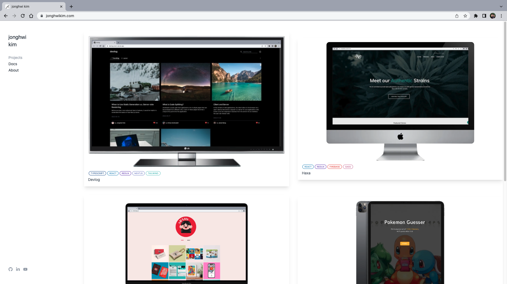

# Jonghwi Kim

> [Jonghwi Kim](https://jonghwikim.com/) is a portfolio website to showcase my projects 🧑🏻‍💻

## Features

- 📱 Responsive design
- 🖼️ Mock-up thumbnail
- 🎨 CSS animation
- 🌌 Preloaded images

## Tech

    
    
    
    
    
    
    

